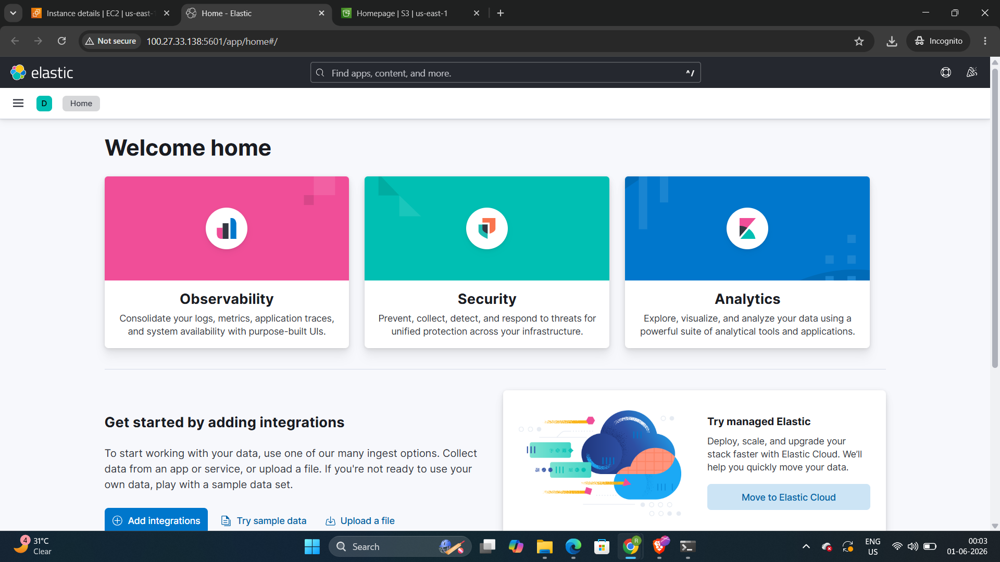
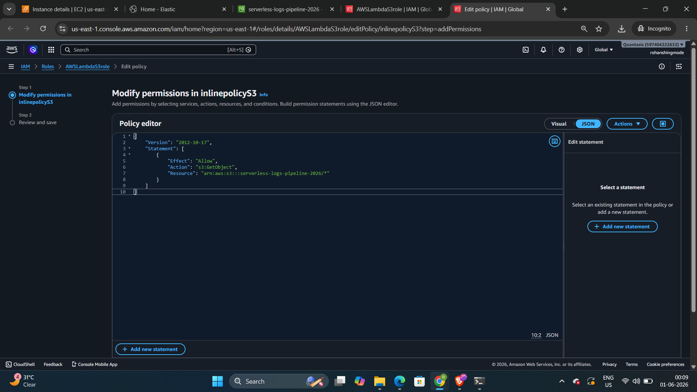
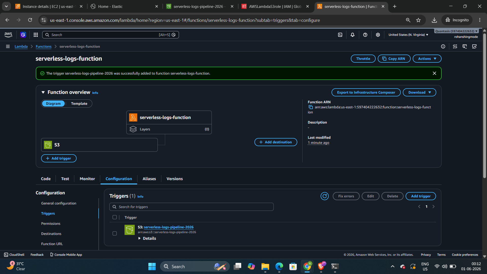
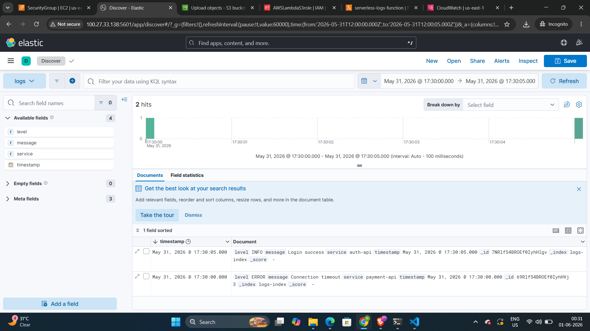

# Event-Driven Serverless Observability Pipeline (AWS & ELK)

 

```text
Application Logs uploaded
         │
         ▼
    [S3 Bucket] ──▶ [Lambda (Python)] ──▶ [Elasticsearch (EC2)] ──▶ [Kibana Dashboard]

```

## 📌 Project Overview

Engineered a real-time, event-driven log ingestion and observability pipeline using AWS serverless compute. This architecture automatically captures, parses, and forwards application logs from Amazon S3 to a centralized ELK Stack (Elasticsearch & Kibana) hosted on an AWS EC2 instance.

By utilizing a serverless parsing engine, this solution eliminates the need for always-on Logstash agents, significantly reducing compute costs while delivering real-time visualization for accelerated incident resolution (MTTR).

## 💡 Business Value & Technical Highlights

* **Zero-Maintenance Compute:** AWS Lambda scales infinitely and automatically based on log volume, meaning you only pay for exact compute milliseconds used during ingestion.
* **Least Privilege Security:** IAM roles strictly scope access, ensuring the parsing engine can only read from specific designated log buckets.
* **Real-Time Observability:** Transforms unstructured JSON log dumps into dynamic, searchable Kibana dashboards instantly.

---

## 📁 Repository Structure

* [`docker-compose.yml`](./docker-compose.yml) - Configuration for deploying the single-node ELK stack on the host machine.
* [`lambda_function.py`](./lambda_function.py) - The Python parser utilized by AWS Lambda to process and forward S3 logs via HTTP POST.
* [`iam_s3_read_policy.json`](./iam_s3_read_policy.json) - The custom, least-privilege IAM inline policy attached to the Lambda execution role.
* [`test-logs.json`](./test-logs.json) - Sample application log data utilized for pipeline validation.

---

## 🚀 Step-by-Step Implementation Guide

### Phase 1: Provisioning the Analytics Engine (ELK Stack)

1. **Infrastructure:** Provisioned a `t3.medium` AWS EC2 instance (Ubuntu) to ensure sufficient memory allocation (4GB RAM) for the Elasticsearch JVM.
2. **Network Security:** Configured the EC2 Security Group inbound rules:
* `Port 22` (SSH) for remote administration.
* `Port 5601` (TCP) for Kibana UI access.
* `Port 9200` (TCP) to allow Lambda to transmit payloads to Elasticsearch.


3. **Container Orchestration:** Deployed the observability engine using the provided `docker-compose.yml`.


### Phase 2: Configuring the Ingestion Source & Security

1. **Landing Zone:** Created an Amazon S3 bucket with all public access strictly blocked to serve as the secure ingestion point for application logs.
2. **Identity & Access Management (IAM):** Created a dedicated Lambda Execution Role. Applied the `AWSLambdaBasicExecutionRole` for CloudWatch logging and attached the custom inline policy (`iam_s3_read_policy.json`) to restrict read-only access to the specific S3 bucket.

3. 

### Phase 3: Deploying the Serverless Parser

1. **Compute Setup:** Deployed an AWS Lambda function running the Python 3.12 runtime.
2. **Code Integration:** Implemented the parsing logic found in `lambda_function.py`, utilizing the native `urllib3` library to avoid external deployment packages.
3. **Event Architecture:** Configured a native `s3:ObjectCreated:*` trigger, linking the S3 bucket to the Lambda function for instantaneous, event-driven execution.

4. 

---

## 🔬 Validation & Results

To validate the pipeline, `test-logs.json` was uploaded to the S3 bucket.

1. **Execution:** The upload event successfully triggered the Lambda function within milliseconds.
2. **Processing:** The Python script parsed the newline-delimited JSON and executed HTTP POST requests to the EC2 Elasticsearch node.
3. **Visualization:** The data was instantly indexed and became searchable/visualizable within Kibana via the `logs-index*` data view.

4. 

---

## 🛠️ Challenges Solved

**Cross-Service Network Timeouts:** During initial testing, the Lambda function execution timed out (3000ms) without successfully delivering payloads to Elasticsearch. By auditing CloudWatch logs and tracing the network path, it was identified that the EC2 Security Group was dropping the packets. The issue was resolved by explicitly opening custom TCP Port `9200` (Elasticsearch API) on the EC2 instance, allowing seamless cross-service communication while maintaining a hardened security posture.

```

```
